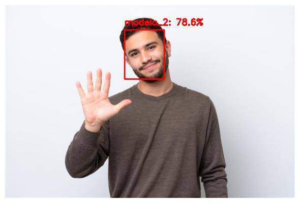

# Desafio 2 — Reconhecimento de Faces

Pipeline de reconhecimento facial em três etapas: detector SSD (Caffe) para localizar a face, OpenFace para extrair embeddings de 128 dimensões, e SVM linear para classificar. Treinado com 7 imagens por pessoa, pequeno o suficiente para funcionar sem GPU.
