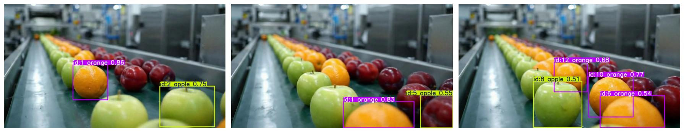

# Desafio 3 — Rastreamento de Objetos

Rastreamento de objetos com YOLO11n usando `model.track()`, onde cada objeto recebe um ID persistente entre frames. O vídeo de teste tem frutas (maçãs e laranjas) sendo rastreadas com conf=0.1 e iou=0.7. Resultado salvo em `output.avi`.
