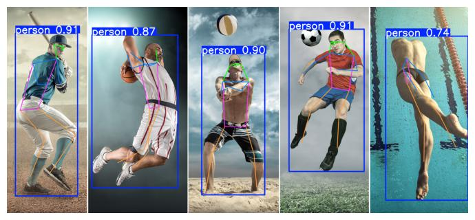

# Desafio 4 — Estimação de Pose

Estimação de pose com YOLO11n-pose, detectando 17 keypoints do corpo humano e desenhando o esqueleto sobre a imagem. Detectou 5 pessoas na imagem de teste com o modelo nano, bem leve para rodar em CPU.
