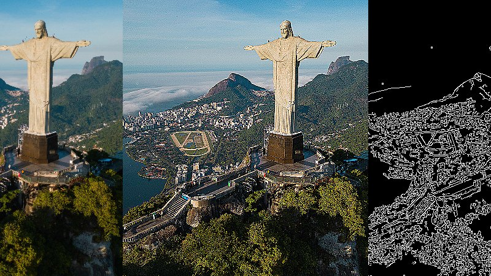

# Módulo 1 — Fundamentos de Visão Computacional

Ponto de entrada do curso. A ideia aqui foi construir familiaridade com as três bibliotecas que aparecem em todos os módulos seguintes: NumPy pra manipulação de arrays, Matplotlib pra visualização e OpenCV pra processamento de imagem. O ritmo foi tranquilo — cada notebook cobre um conceito isolado antes de combinar tudo.

O que tomou mais tempo foi entender como o OpenCV representa imagens em BGR em vez de RGB, e como isso afeta a visualização com Matplotlib. Qualquer imagem exibida sem conversão sai com as cores erradas.

## Atividades

| Atividade | O que foi feito | Output |
|-----------|-----------------|--------|
| M1A4 — Introdução a OpenCV | Leitura de imagens e vídeo (`cv2.VideoCapture`), transformações básicas (blur gaussiano, flip, separação de canais RGB) | Frames do vídeo exibidos com canais separados e efeitos aplicados |
| M1A2 — Manipulação de arrays NumPy | Operações com vetores e matrizes: soma, produto interno, cross product, `np.dot` vs `@` vs `np.matmul` | Resultados numéricos; comparação entre três formas equivalentes de produto interno |
| M1A3 — Visualização de Imagens | Leitura com Matplotlib, conversão entre espaços de cores (RGB, grayscale), criação de arrays como imagem | `bahia.jpeg` e `rio.jpeg` em diferentes representações; gradiente gerado com NumPy |
| M1A4 — Operações Básicas em Imagens | Crop, resize, rotação, flip, transformação de perspectiva, desenho de formas e texto com OpenCV | Visualizações side-by-side de cada transformação sobre `rio.jpeg` |
| M1A5 — Filtros Espaciais e Convoluções | Kernels aplicados manualmente com `cv2.filter2D`: blur, sharpening, emboss, laplaciano, Canny | Imagens filtradas de `rio.jpeg`; comparação visual antes/depois de cada kernel |
