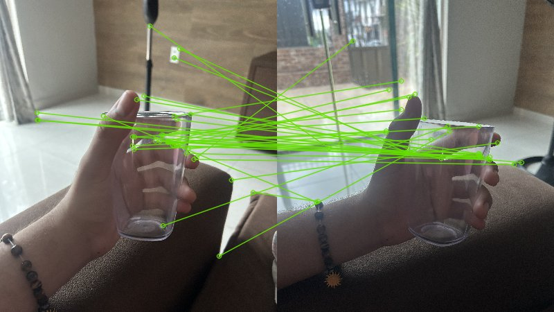

# Módulo 2 — Características e Descritores

Módulo focado em representar imagens por pontos de interesse — keypoints — em vez de pixels brutos. Cobre extração de descritores com SIFT e ORB, correspondências entre imagens e uma introdução a redes pré-treinadas para classificação.

A parte mais interessante foi comparar SIFT e ORB no mesmo par de imagens: ORB é muito mais rápido mas os matches ficam mais ruidosos. Baixar o `contrastThreshold` do SIFT aumenta bastante o número de keypoints detectados, mas começa a pegar regiões sem muito significado.

## Atividades

| Atividade | O que foi feito | Output |
|-----------|-----------------|--------|
| M2A1 — Detecção e Extração de Características | Extração de keypoints com SIFT (ajuste de `contrastThreshold` e `nfeatures`), AKAZE e comparação entre detectores | Imagens com keypoints desenhados; comparação visual entre SIFT padrão, ajustado e AKAZE |
| M2A2 — Correspondências de Características | Matching ORB e SIFT entre pares de fotos da mão (`minhamao_1/2/3.jpeg`) com `BFMatcher` | Visualização das correspondências entre pares; SIFT produziu matches mais robustos que ORB |
| M2A10 — Modelos Pré-Treinados | Classificação com VGG-16 e ResNet-50 (ImageNet); comparação de top-5 probabilidades entre os dois modelos | Ambos predisseram "Border collie" corretamente; gráfico de probabilidades por classe |
