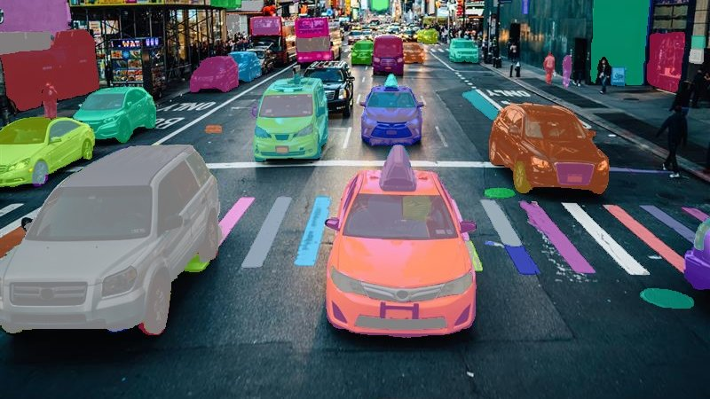

# Módulo 3 — Redes neurais convolucionais

Módulo onde as coisas ficam mais concretas: modelos que localizam e segmentam objetos em vez de só classificar. Começa com inferência direta em modelos pré-treinados (YOLO, SAM2) e depois entra em fine-tuning com transfer learning.

O fine-tuning do VGG-16 no CIFAR-10 deixou claro o quanto o número de parâmetros importa — MobileNetV2 com 3.4M parâmetros vs 138M do VGG-16 partiu do mesmo ponto mas com comportamento bem diferente durante o treino. A segmentação semântica com DeepLabV3 foi o primeiro contato com saídas pixel-a-pixel em vez de bounding boxes.

## Atividades

| Atividade | O que foi feito | Output |
|-----------|-----------------|--------|
| M3A5 — Detecção de Objetos | Inferência com YOLO11n em cena de rua; ajuste do threshold de confiança | Detectou 7 pessoas, 16 carros, 1 ônibus e 1 caminhão em `street.jpeg`; bounding boxes com labels e scores |
| M3A3 — Transfer Learning | Fine-tuning de VGG-16 no CIFAR-10; baseline MobileNetV2 (8.2% sem fine-tuning, 138M vs 3.4M params) | Curvas de loss por batch; comparação de convergência entre as duas arquiteturas |
| M3A6 — Segmentação Semântica | Segmentação de instâncias com YOLO11n-seg e SAM2; segmentação semântica com DeepLabV3 via CLI da Ultralytics | Máscaras sobre `street.jpeg`; comparação entre segmentação de instância (YOLO) e semântica (DeepLabV3) |
