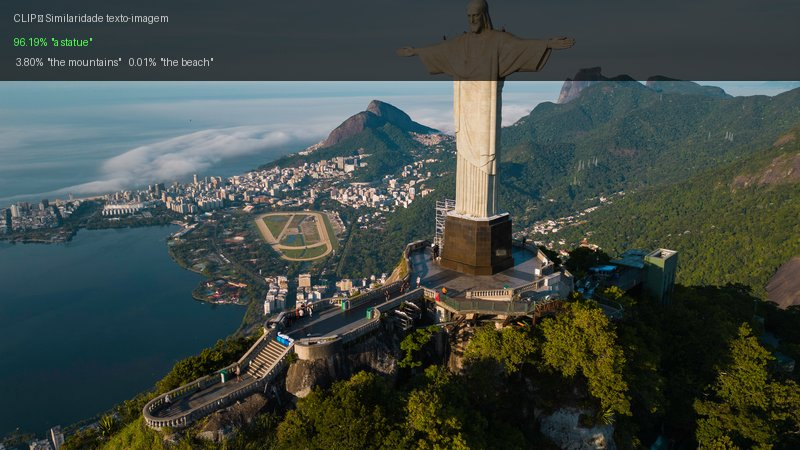

# Módulo 4 — Modelos gerativos

Dois tópicos bem diferentes: GANs, que geram imagens do zero a partir de ruído, e CLIP, que conecta texto e imagem num espaço de embeddings compartilhado. É o módulo mais pesado computacionalmente — treinar GAN por 50 épocas sem GPU demora bastante.

A parte mais reveladora foi testar o que acontece com a GAN quando se muda o learning rate. Com `lr=0.001` (vs o padrão de `0.0002`) o treinamento colapsou completamente — `loss_g` foi a 100 já nas primeiras épocas e o gerador parou de aprender. GANs são bem sensíveis a isso. Com FashionMNIST e o LR original os resultados foram visivelmente melhores que com MNIST.

> GPU recomendada para M4A2 (treino da GAN).

## Atividades

| Atividade | O que foi feito | Output |
|-----------|-----------------|--------|
| M4A2 — GANs | Treino de GAN no MNIST e FashionMNIST com PyTorch; comparação de `lr=0.0002` vs `lr=0.001` | FashionMNIST com LR correto gerou silhuetas reconhecíveis de roupas; LR alto causou mode collapse |
| M4A5 — Modelos Multimodais | CLIP (ViT-B/32 e RN50) para similaridade texto-imagem e zero-shot classification | 96.19% "a statue" para foto do Rio; 99.93% "a dog sitting" para foto do cachorro; ViT e RN50 deram resultados similares |
