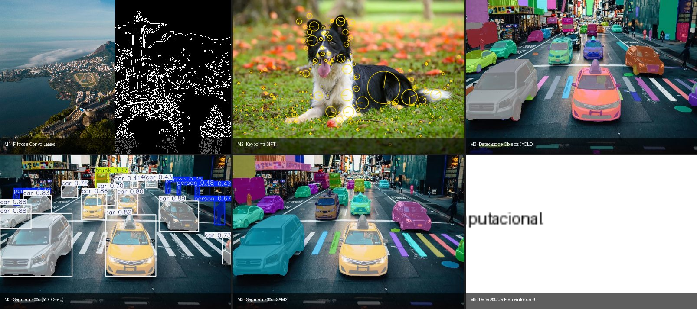

# Projeto de Residência em Visão Computacional



Jupyter Notebooks da residência em Visão Computacional. Seis módulos cobrindo desde fundamentos de processamento de imagem até aplicações práticas com detecção de objetos, segmentação e modelos multimodais.

## Setup

Requisito: Python ≥ 3.9

```bash
python -m venv .venv
source .venv/bin/activate   # macOS / Linux
pip install -r requirements.txt
```

## Módulos

### Módulo 1 — Tópicos específicos em programação aplicados a visão computacional

Introdução ao processamento de imagens com OpenCV e NumPy.

| Notebook | Tema |
|----------|------|
| `M1A4 - Introdução a OpenCV.ipynb` | Leitura de imagens e vídeo, transformações básicas |
| `VC_M1A2 - Manipulacaoo_arrays_NumPy.ipynb` | Vetores e matrizes com NumPy |
| `VC_M1A3 - Visualização de Imagens.ipynb` | Visualização e espaços de cores com Matplotlib |
| `VC_M1A4 - Operações Básicas em Imagens.ipynb` | Crop, resize, rotação, flip, perspectiva |
| `VC_M1A5 - Fundamentos de Filtros Espaciais e Convoluções.ipynb` | Filtros, kernels e convolução 2D |

### Módulo 2 — Tópicos em aprendizagem de máquina

Detecção de keypoints e correspondências entre imagens.

| Notebook | Tema |
|----------|------|
| `VC_M2A1 - Detecção e Extração de Características.ipynb` | SIFT, AKAZE e comparação de detectores |
| `M2A2 - Correspondências de Características.ipynb` | Feature matching com ORB e SIFT |
| `M2A10 - Modelos Pré-Treinados.ipynb` | Classificação com VGG-16 e ResNet-50 |

### Módulo 3 — Redes neurais convolucionais

Detecção de objetos e segmentação semântica com modelos pré-treinados e fine-tuning.

| Notebook | Tema |
|----------|------|
| `M3A5 - Detecção de objetos.ipynb` | Detecção com YOLO11n |
| `VC_M3A3 - Transfer learning e Refinamento com Redes Pré-treinadas .ipynb` | Fine-tuning de VGG-16 e MobileNetV2 |
| `VC_M3A6 - Segmentação semântica.ipynb` | Segmentação com YOLO-seg e DeepLabV3 |

### Módulo 4 — Modelos gerativos

Redes generativas e modelos multimodais.

| Notebook | Tema |
|----------|------|
| `VC_M4A2 - GANs .ipynb` | Treino de GAN com PyTorch |
| `VC_M4A5 - Fundamentos de Modelos Multimodais.ipynb` | Embeddings texto-imagem com CLIP |

### Módulo 5 — Projetos reais de visão computacional

Projetos aplicados de visão computacional em cenários reais.

| Notebook | Tema |
|----------|------|
| `VC_M5A1 - Inspeção Visual de Itens em Esteira de Manufatura.ipynb` | Detecção de defeitos industriais |
| `VC_M5A2 - Reconhecimento de Texto.ipynb` | OCR com EasyOCR |
| `VC_M5A3 - Identificação de elementos visuais em UI de aplicativos.ipynb` | Detecção de componentes de UI |
| `VC_M5A4 - Sistema de vigilância.ipynb` | Rastreamento em vídeo |
| `VC_M5A5 - Segmentação de falhas em tecidos.ipynb` | Segmentação de anomalias em tecidos |
| `VC_M5A6 - Detecção de faixas para veículos autônomos.ipynb` | Lane detection |

### Módulo 6 — ML OPS

| Notebook | Tema |
|----------|------|
| `M6A3 - Sistemas de Monitoramento de Experimentos 1.ipynb` | Logging e visualização com TensorBoard |

## Estrutura do Repositório

```
Jupyter Notebooks/
├── Modulo1/ … Modulo6/     # notebooks .ipynb de cada atividade
├── assets/
│   ├── modulo1/ … modulo6/ # imagens e vídeos de entrada por módulo
│   └── *.jpeg              # assets compartilhados entre módulos
├── models/
│   ├── modulo1/ … modulo6/ # pesos e checkpoints treinados por módulo
├── requirements.txt
└── README.md
```

- Notebooks ficam em `Modulo{N}/` — sem assets ou modelos junto
- Assets (imagens, vídeos) vão em `assets/modulo{N}/`
- Modelos treinados (`.pt`, `.pth`) vão em `models/modulo{N}/`

## Convenções

**Nomenclatura de notebooks:**

```
VC_M{módulo}A{atividade} - {Título}.ipynb
```

Exemplo: `VC_M5A3 - Identificação de elementos visuais em UI de aplicativos.ipynb`

**Execução:** cada notebook deve rodar célula a célula, em ordem, sem pular células. Não há dependências entre módulos.
